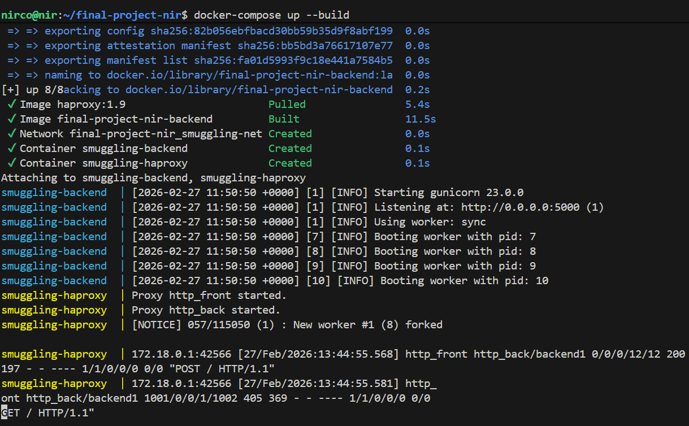

[](https://classroom.github.com/a/Nt4zUlkt)
<div dir="rtl">

# פרויקט מסכם: מחקר, מימוש והגנה מפני מתקפת HTTP Request Smuggling (מסלול A)

## מבוא
פרויקט זה מתמקד בניתוח עומק של תעבורת HTTP וניצול מנגנוני ניתוב הבקשות באינטרנט. מטרת הפרויקט היא להדגים הלכה למעשה כיצד חוסר סנכרון (Desynchronization) בין שרתי חזית (Frontend/Proxy) לשרתי יישום (Backend) מוביל לחולשת **HTTP Request Smuggling**, וכן לחקור כיצד מנגנוני הגנה מודרניים מתמודדים עם ניסיונות הסלמה (Escalation) של המתקפה.

## 1. רקע תיאורטי והסבר החולשה
בתשתיות אינטרנט מודרניות, בקשות הלקוח עוברות דרך רכיבי קצה (כגון Load Balancers או Reverse Proxies) לפני שהן מגיעות לשרת היישום. כדי לייעל את התקשורת, שרתים אלו משתמשים במנגנון HTTP Keep-Alive, המאפשר העברת מספר בקשות HTTP על גבי חיבור TCP יחיד.

כדי שהשרתים ידעו היכן מסתיימת בקשה אחת ומתחילה הבאה, פרוטוקול HTTP/1.1 מספק שתי שיטות להגדרת אורך גוף הבקשה:
* **`Content-Length` (CL):** ציון מפורש של מספר הבתים המרכיבים את גוף הבקשה.
* **`Transfer-Encoding: chunked` (TE):** שידור הנתונים במקטעים, כאשר הבקשה מסתיימת עם קבלת מקטע בגודל `0`.


**מהות החולשה (CL.TE):**
החולשה מתרחשת כאשר תוקף שולח בקשה המכילה את שתי הכותרות יחד בצורה מעורפלת. שרת ה-Frontend מפרש את הבקשה לפי ה-`Content-Length` ומעביר את כל המטען פנימה. לעומתו, שרת ה-Backend מפרש את הבקשה לפי ה-`Transfer-Encoding`, קורא את מקטע הסיום (`0`), ומניח שהבקשה הסתיימה. כתוצאה מכך, שארית המידע שהתוקף שלח נשארת "תלויה" בזיכרון (Buffer) של שרת ה-Backend, ומשורשרת לבקשה הלגיטימית של המשתמש הבא באותו חיבור.

## 2. סביבת המעבדה
לצורך המחקר הוקמה סביבת תרגול פגיעה מבוססת Docker Compose:
* **Frontend:** שרת HAProxy (גרסה 1.9), המוגדר להעביר חיבורים הלאה תוך שימוש חוזר בחיבורי TCP (`http-reuse always`). שרת זה משמש גם כ-WAF בסיסי החוסם גישה לנתיב `/admin`.
* **Backend:** שרת Python/Flask הרץ מעל Gunicorn (בגרסאות ישנות שאינן מנרמלות כותרות באופן מחמיר), המוגדר לתמוך ב-Keep-Alive ומעדיף את כותרת ה-`Transfer-Encoding`.

## 3. הוכחת התכנות (Proof of Concept) - הרעלת בקשה
בשלב הראשון, הוכחנו את קיום חוסר הסנכרון באמצעות הרעלת הבקשה של משתמש תמים. 

באמצעות סקריפט Python שניגש ישירות ל-TCP Socket, שלחנו את הבקשה הבאה:

</div>

```http
POST / HTTP/1.1
Host: 127.0.0.1
Connection: keep-alive
Content-Length: 6
Transfer-Encoding: chunked

0

G
```

<div dir="rtl">

ה-Frontend העביר את כל הבלוק (6 בתים). ה-Backend קרא את ה-`0`, סיים את הבקשה, והשאיר את האות `G` בזיכרון. 
כאשר הקורבן שלח מיד לאחר מכן בקשת `GET / HTTP/1.1` תמימה, השרת האחורי שרשר את ה-`G` והתייחס לבקשה כ-`GGET / HTTP/1.1`.
**תוצאה:** השרת החזיר לקורבן שגיאת `405 Method Not Allowed`. הוכח כי ניתן להשפיע על תעבורה של משתמשים אחרים.

**פלט הטרמינל המדגים את הצלחת המתקפה:**
 
## 4. מחקר מתקדם: ניסיון הסלמה ומנגנוני הגנה בעולם האמיתי
לאחר הוכחת החולשה, מטרת המחקר התמקדה בניסיון הסלמה (Escalation) - עקיפת בקרת הגישה (WAF) של ה-Frontend כדי לשלוף נתונים רגישים מנתיב ה-`/admin` החסום. שלב זה חשף את האופן שבו מנגנוני הגנה מודרניים מתמודדים עם אנומליות ברשת.

**ניסיון 1: הברחת בקשה שלמה (Access Control Bypass)**
ניסינו להבריח בקשת `POST /admin` שלמה בתוך גוף הבקשה החוקית, מתוך מטרה ש"תשאב" את בקשת הקורבן לתוכה ותחזיר לו את המידע הרגיש.
* **תוצאה:** ה-HAProxy זיהה את הבקשה הפנימית, הפעיל את חוקי ה-ACL שלו וחסם את המתקפה עם שגיאת `403 Forbidden`. הדבר ממחיש כי גם כאשר יש חוסר סנכרון, ה-Proxy עדיין מנתח את התעבורה היוצאת והנכנסת.

**ניסיון 2: טשטוש כותרות (Header Obfuscation)**
כדי לעקוף את הזיהוי של HAProxy, ניסינו "ללכלך" את כותרת ה-`Transfer-Encoding` באמצעות תווים מיוחדים כגון רווח לפני הנקודתיים (`Transfer-Encoding : chunked`) או תווי שליטה נסתרים (`\x0b`), מתוך תקווה שה-Frontend יתעלם מהכותרת אך ה-Backend ינרמל אותה.
* **תוצאה:** ה-HAProxy הפעיל מנגנון **Strict HTTP Parsing**. ברגע שזיהה חריגה מתקן RFC 7230 של פרוטוקול HTTP (האוסר על רווחים או תווי שליטה בכותרות), הוא דחה את הבקשה לחלוטין עם שגיאת `400 Bad Request` וסגר את חיבור ה-TCP.


## 5. מסקנות ודרכי מניעה
הניסויים בפרויקט ממחישים את החשיבות של ארכיטקטורת אבטחה מרובדת (Defense in Depth). בעוד שחולשת הדה-סינכרוניזציה קיימת, הניצול שלה בפועל מורכב ודורש עקיפה של מנגנונים קפדניים.

כדי למנוע מתקפות Request Smuggling לחלוטין, יש לנקוט בצעדים הבאים:
1. **שימוש ב-HTTP/2 מקצה לקצה:** הפרוטוקול משתמש במסגור בינארי (Binary Framing) לקביעת אורך הבקשה, ואינו מסתמך על כותרות טקסטואליות מתנגשות.
2. **עדכון שרתי Backend (כפי שנצפה במהלך המחקר):** שרתים מודרניים (כגון Gunicorn בגרסאותיו האחרונות) סוגרים אוטומטית חיבורי TCP כאשר הם מזהים כותרות מתנגשות או בקשות החשודות כמוברחות.
3. **אכיפת Strict Routing & Parsing:** הגדרת ה-WAF וה-Frontend לדחות כל בקשה המכילה כותרות דו-משמעיות (גם TE וגם CL) עם שגיאת `400 Bad Request`, בטרם העברתה לרשת הפנימית.

</div>